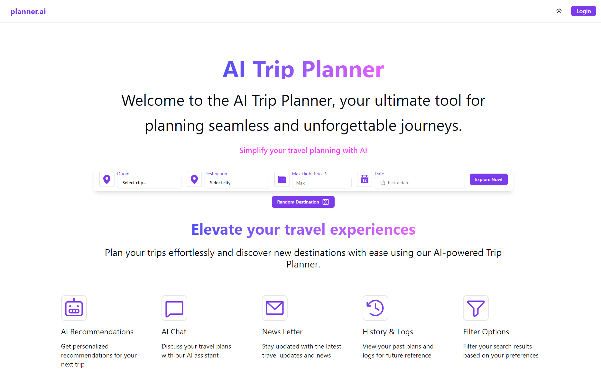

<!-- PROJECT LOGO -->
 

  

  <h3 align="center">planner.ai</h3>

  

    Simplify your travel planning with AI
     
    <a href="#"><strong>Explore the planner.ai »</strong></a>
     
     
  

<!-- TABLE OF CONTENTS -->

  
Table of Contents

  <ol>
    <li>
      <a href="#about-the-project">About The Project</a>
    </li>
    <li>
        <a href="#built-with">Built with</a>
        <ul>
            <li><a href="#front-end">Front end</a></li>
            <li><a href="#ui">UI</a></li>
            <li><a href="#auth">Auth</a></li>
            <li><a href="#back-end">Back end</a></li>
      </ul>
    </li>
    <li><a href="#contact">Contact</a></li>
  </ol>

<!-- ABOUT THE PROJECT -->

## About The Project

This app was developed to participate in the [FCUP Update 23/24 Hackathon](https://www.instagram.com/nucc_fcup/) and it consists of an AI that can help plan your trips! 🌍

Inside the app, you will find several functionalities, including:

- Ability to generate a plan (for a trip which includes the best places to visit, some tips, useful information, etc. 📅)
- Talk with the AI to get some help with your trip planning
- Get a newsletter everyday with some tips, useful information, and flight prices, etc...
- Save previous trips and plans to access them later 📂
- Very secure authentication with Hanko (Hanko works with 2FA, 0auth, passwords, passkeys, and more) 🔒

(<a href="#readme-top">back to top</a>)

## Built With

#### Front-end

- Node 🟢
- Javascript 📘
- Vite 🌀
- React ⚛️
- AI (Vercel) 🤖 (Good form reiving streaming responses)

##### UI

- Tailwind CSS 🎨
- Radix UI 🖌️
- Shadcn UI 🎆

#### AUTH

- Hanko 🔒

#### Back-end

- Node 🟢
- Typescript 📘
- Fastify 🚀
- OpenAI 🧠 (Sometimes with streaming, and some prompt engineering)
- ORM: Prisma 🛠️
- Database: SqlLite 📊

(<a href="#readme-top">back to top</a>)

<!-- CONTACT -->

## Contact

Ricardo Freitas - [@rmotafreitas](https://x.com/rmotafreitas)

Project Link: [https://github.com/rmotafreitas/UPDATE2324](https://github.com/rmotafreitas/UPDATE2324)

(<a href="#readme-top">back to top</a>)

> Note: Setup is in [docs/setup.md](./docs/setup.md)
